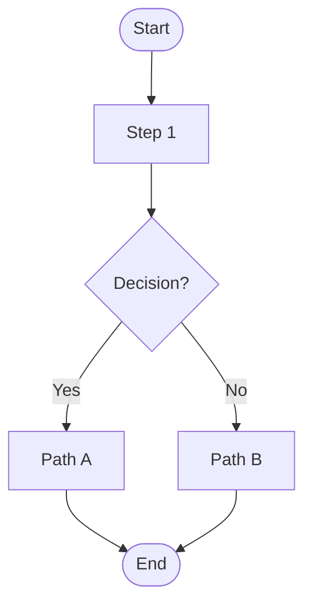
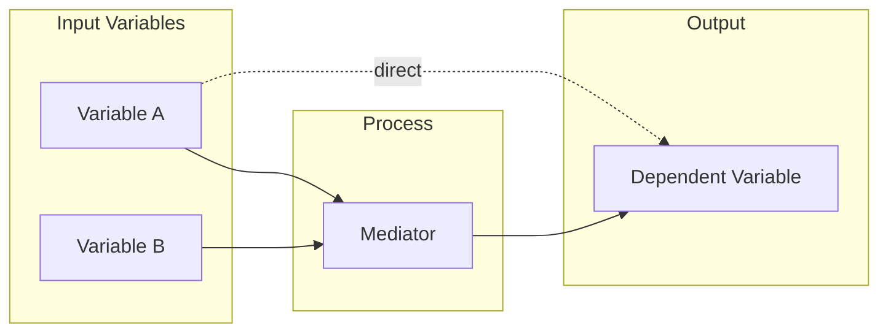
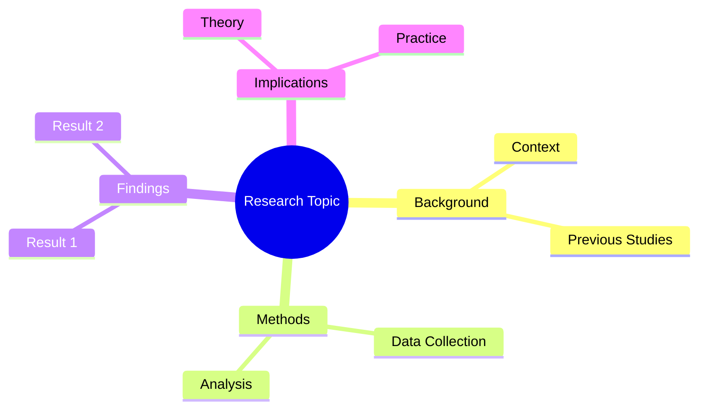
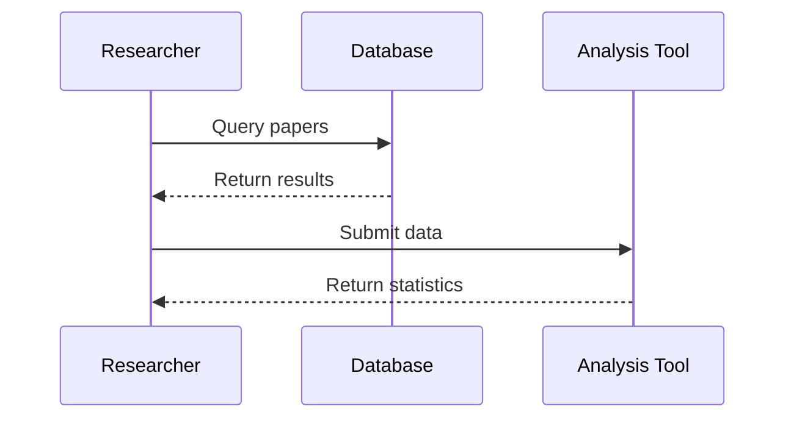

# Data Visualization Skill

## Overview

This skill creates two types of visuals:
1. **Statistical charts** — using matplotlib/seaborn/plotly (from data)
2. **Conceptual diagrams** — using Mermaid (flowcharts, sequence, mind maps)

All figures are saved to `/workspace/output/charts/` with descriptive filenames.

---

## Chart Type Selection Guide

| User says... | Chart type | Library |
|---|---|---|
| Compare groups | Bar chart / Box plot | seaborn |
| Show trend over time | Line chart | matplotlib |
| Show relationship | Scatter plot | seaborn |
| Show distribution | Histogram / KDE | seaborn |
| Show correlations | Heatmap | seaborn |
| Show composition | Pie / Donut | matplotlib |
| Show hierarchy / flow | Flowchart | Mermaid |
| Show process | Sequence diagram | Mermaid |
| Show concepts | Mind map | Mermaid |
| Show framework | Block diagram | Mermaid |

---

## Step-by-Step: Statistical Charts

### Setup (always run first)
```python
import matplotlib.pyplot as plt
import matplotlib as mpl
import seaborn as sns
import pandas as pd
import numpy as np
import os

# Publication-quality settings
mpl.rcParams.update({
    'font.family': 'DejaVu Sans',
    'font.size': 11,
    'axes.titlesize': 13,
    'axes.labelsize': 12,
    'axes.spines.top': False,
    'axes.spines.right': False,
    'figure.dpi': 150,
    'savefig.dpi': 300,
    'savefig.bbox': 'tight',
    'figure.figsize': (8, 5),
})
sns.set_theme(style="whitegrid", palette="muted")

os.makedirs("/workspace/output/charts", exist_ok=True)
```

### Bar Chart
```python
fig, ax = plt.subplots()
bars = ax.bar(categories, values, color=sns.color_palette("muted"), edgecolor='white', linewidth=0.8)

# Add value labels on bars
for bar in bars:
    height = bar.get_height()
    ax.annotate(f'{height:.1f}',
                xy=(bar.get_x() + bar.get_width() / 2, height),
                xytext=(0, 3), textcoords="offset points",
                ha='center', fontsize=10)

ax.set_title("Figure X. [Descriptive Title]", pad=15)
ax.set_xlabel("[X Label]")
ax.set_ylabel("[Y Label]")
plt.tight_layout()
plt.savefig("/workspace/output/charts/figure_X_barplot.png")
plt.close()
```

### Grouped Bar Chart
```python
x = np.arange(len(categories))
width = 0.35
fig, ax = plt.subplots()
rects1 = ax.bar(x - width/2, values1, width, label='Group 1')
rects2 = ax.bar(x + width/2, values2, width, label='Group 2')
ax.set_xticks(x)
ax.set_xticklabels(categories)
ax.legend()
plt.tight_layout()
plt.savefig("/workspace/output/charts/figure_X_grouped_bar.png")
plt.close()
```

### Scatter Plot with Regression Line
```python
fig, ax = plt.subplots()
sns.regplot(x=df['x_var'], y=df['y_var'], ax=ax,
            scatter_kws={'alpha': 0.6, 's': 50},
            line_kws={'color': '#e63946', 'lw': 2})
ax.set_title(f"Figure X. Scatter Plot: [X] vs [Y] (r = {r_value:.2f}, p = {p_value:.3f})")
ax.set_xlabel("[X Variable Label]")
ax.set_ylabel("[Y Variable Label]")
plt.savefig("/workspace/output/charts/figure_X_scatter.png")
plt.close()
```

### Box Plot (group comparisons)
```python
fig, ax = plt.subplots()
sns.boxplot(x='group', y='value', data=df, ax=ax, palette="muted",
            width=0.5, fliersize=4)
sns.stripplot(x='group', y='value', data=df, ax=ax, 
              color='#333333', alpha=0.4, size=3, jitter=True)
ax.set_title("Figure X. [Title]")
plt.savefig("/workspace/output/charts/figure_X_boxplot.png")
plt.close()
```

### Correlation Heatmap
```python
corr_matrix = df[numeric_cols].corr()
mask = np.triu(np.ones_like(corr_matrix, dtype=bool))
fig, ax = plt.subplots(figsize=(10, 8))
sns.heatmap(corr_matrix, mask=mask, annot=True, fmt=".2f",
            cmap='RdYlBu_r', center=0, square=True,
            linewidths=0.5, ax=ax)
ax.set_title("Figure X. Correlation Matrix")
plt.tight_layout()
plt.savefig("/workspace/output/charts/figure_X_correlation_heatmap.png")
plt.close()
```

### Line Chart (trend over time)
```python
fig, ax = plt.subplots()
for group, data in df.groupby('group'):
    ax.plot(data['time'], data['value'], marker='o', label=group, linewidth=2)
ax.set_title("Figure X. [Trend Title]")
ax.set_xlabel("[Time/X Label]")
ax.set_ylabel("[Value Label]")
ax.legend()
plt.tight_layout()
plt.savefig("/workspace/output/charts/figure_X_lineplot.png")
plt.close()
```

---

## Step-by-Step: Mermaid Diagrams

Mermaid diagrams are rendered using `mmdc` (Mermaid CLI). Always check if it's available:

```bash
which mmdc || npm install -g @mermaid-js/mermaid-cli
```

### Save and Render Mermaid

```bash
# Step 1: Write the .mmd file
cat > /tmp/diagram.mmd << 'EOF'
[MERMAID CONTENT HERE]
EOF

# Step 2: Render to PNG
mmdc -i /tmp/diagram.mmd -o /workspace/output/charts/diagram_name.png -w 1200 -H 800 --backgroundColor white

# Step 3: Also save the source
cp /tmp/diagram.mmd /workspace/output/charts/diagram_name.mmd
```

### Flowchart Template


### Research Framework Diagram


### Mind Map Template


### Sequence Diagram Template


---

## Figure Naming Convention

`figure_[number]_[type]_[description].png`

Examples:
- `figure_1_barplot_mean_scores_by_group.png`
- `figure_2_scatter_age_vs_performance.png`
- `figure_3_heatmap_correlations.png`
- `diagram_conceptual_framework.png`
- `diagram_research_flowchart.png`

---

## Figure Caption Template (APA 7)

```
Figure [N]
[Descriptive title starting with capital, ending without period]
Note. [Optional explanatory note. Abbreviations defined here. n = XX.]
```

---

## Output Summary

After creating charts, report:
1. List of all files created with paths
2. Suggested APA figure captions for each
3. Recommended placement in the report (e.g., "Figure 1 should appear after the descriptive statistics paragraph")
